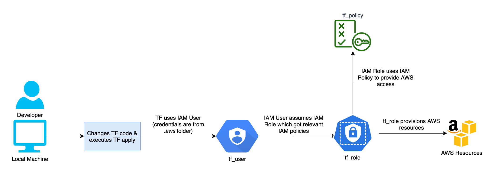

# AWS setup and configuration

This document outlines the steps required to set up an AWS account with its resources and the associated configuration. 

## Create an AWS Account

 - Navigate to [Create an AWS Account](https://portal.aws.amazon.com/billing/signup#/start/email) page. 
 - Enter a valid email id and root username. Proceed to verify the email id.
 - Provide contact and address information.
 - Enter Credit / Debit card information for billing purpose. Proceed to verify the card details through the respective bank's authentication system (typically OTP).
    - A nominal fee of 2 INR (Indian currency) will be deducted to verify the authenticity of the card.
    - Going forward card will not charged if the usage is within the limits of free tier. But once exceeded, card will be charged based on usage.
 - Confirm the identity by entering mobile no. and verifying it with OTP.
 - Lastly select the `Basic Support - Free plan` as we only need this AWS account of executing our exercises.

<br />

Let's enable MFA for our root user. Login at [AWS Console](https://console.aws.amazon.com/) with root user email and password. Go to IAM resource (through global search in AWS console).

<br />


<br />

Proceed with the next flow of steps to enable MFA through apps like Google Authenticator, OKTA Verify, Duo Security etc.

<br />


<br /> 


## Create an IAM user group, user, role, and policy to provide access to Terraform

When we created an AWS account, a root user account was provisioned for us. This account has the highest possible privileges, through which it can administer the entire AWS account. Hence leveraging the root user account for specific activities like IaC automations, etc., is highly unadvisable. We will create an appropriate IAM user with a specific role and policies with limited privileges that can be used for IaC automations through Terraform.

> NOTE: We can leverage Terraform to create the IAM user, role, and policies. However, as this is the first step towards setting up Terraform, we will proceed to manually create the required AWS resources. Later in this repo, when we work on the IAM user related automations, we will revisit and address this tech debt.

> NOTE: To keep things simple, we will create a policy which will provide limited access to S3 service. This can be extended to all other services which `tf_user` needs to access.



Let's get started by creating an IAM user group at the [AWS Console](https://console.aws.amazon.com/).

- Enter `tf_user_group` as name for the group
- No additional configuration is required, proceed to create the group

<br />

Created `tf_user_group`.

<br />


<br />

Now lets proceed to create an IAM user.

- Enter `tf_user` as name
- Associate the `tf_user` with `tf_user_group`
- No additional configuration is required, review and create the user

<br />

Created `tf_user`.

<br />


<br />

Let's enable access keys for `tf_user` using which Terraform can access AWS and maintain resources. 

- Navigate to `Security Credentials` section of `tf_user`
- Select `create access key` option
- Select `Command Line Interface (CLI)` as the use case
- Create access key
- Copy the generated Access key and Secret. **Store them in a SECURE PLACE**.
   - We will use these credentials in a while.

<br />


<br />

As the next step, we will create an AWS Policy. This policy will only have least possible privileges which are absolutely required for terraform activities. This way we can limit the overall access of terraform user to AWS resources.

> NOTE: As already mentioned aboved, to keep things simple, we will create a policy which will provide limited access to S3 service. This can be extended to all other services which `tf_user` needs to access.

- Select `JSON` option after selecting the `Create policy`.
- Enter below JSON which will provide all `LIST`, `GET` permissions on S3 bucket. It also provides `CREATE`, `DELETE` of S3 bucket, objects and Acl.

```
{
    "Version": "2012-10-17",
    "Statement": [
        {
            "Sid": "VisualEditor0",
            "Effect": "Allow",
            "Action": [
                "s3:Get*",
                "s3:List*",
                "s3:PutObject",
                "s3:PutBucketAcl",
                "s3:CreateBucket",
                "s3:DeleteObject",
                "s3:DeleteBucket",
                "s3:PutObjectAcl"
            ],
            "Resource": "*"
        }
    ]
}
```
- Review and create by entering `tf_policy` as name (`description` and `tags` are optional). 

<br />


<br /> 

Now we will proceed to create an IAM Role which our `tf_user` can assume for provisioning and maintaining AWS resources. The IAM role will have the `tf_policy` attached to it for providing access to `tf_user`.

- Select `Custom trust policy`
- Enter below statement as the policy.

```
{
	"Version": "2012-10-17",
	"Statement": [
		{
			"Sid": "tfrole",
			"Effect": "Allow",
			"Principal": {
				"AWS": "arn:aws:iam::XXXXXXXXXXXX:user/tf_user"
			},
			"Action": "sts:AssumeRole"
		}
	]
}
```
- Select `tf_policy` in Add permissions section.
- Create role by entering `tf_role` as the name (`description` and `tags` are optional). 

<br />


<br />


<br />

with all the above steps, we have create an IAM User Group, User, Policy and Role to provision an S3 bucket with least previleges.

<br />

## Configure Terraform with AWS Credentials

There are many ways to configure Terraform with IAM User (`tf_user`) credentials at local development machine. We pick up the most secure approach which will be convenient for developers to work with on day to day basis.

Create `.aws` folder at the root of the repository and create a file with name `credentials`. The credentials file is going to hold the IAM User credentials.

> NOTE: The `credentials` file should not be versioned at Git. So also add `.aws/credentials` as an entry to `.gitignore` file.

Enter the IAM User credentials as below.

```
[development]
aws_access_key_id = XXXXXXXXXXXXXXXXXXXX
aws_secret_access_key = XXXXXXXXXXXXXXXXXX
```

That's it, we are now good to get started with Terraform with our `tf_user`.

> NOTE: Alternatively, if the above mentioned approach doesn't suit your needs, then feel free to set the credentials in `environment variables`.

## Setup shared configuration for Terraform 

Under `.aws` folder at the root of the repository and create a file with name `config`.

> NOTE: The `config` file can be versioned through Git.

Enter the following shared configuration which defined the AWS region and Terraform output format.

```
[development]
region = us-east-2
output = json
```