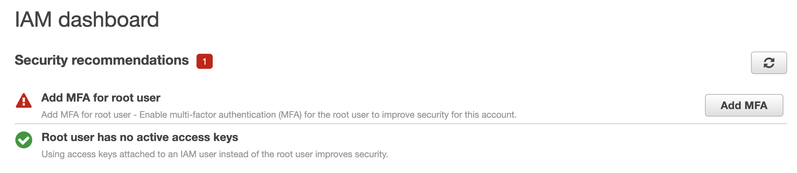
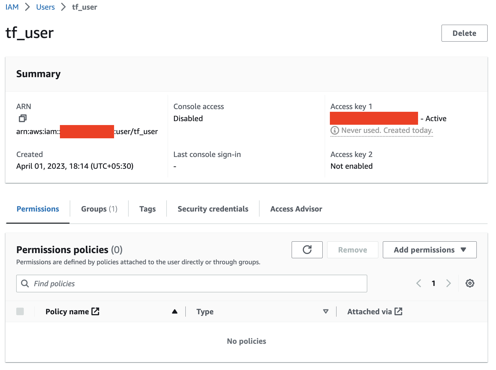
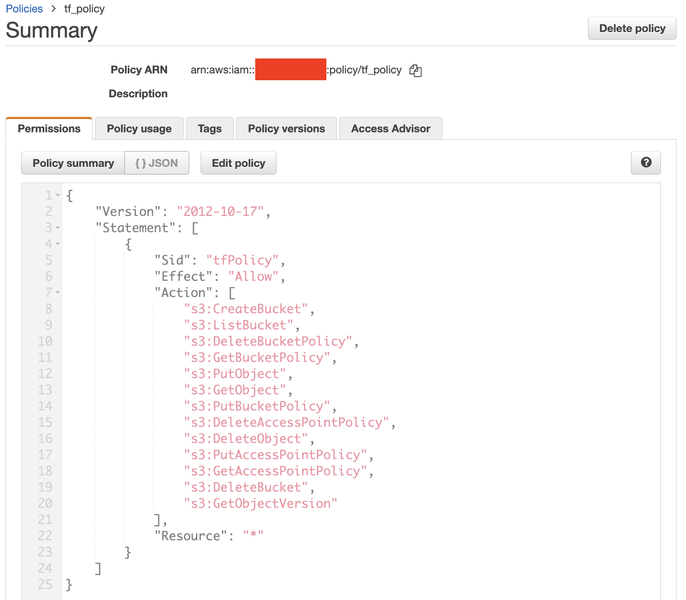

# Development Machine Setup

This document outlines different required and optional tools, frameworks, cli, configuration etc., required on your local machine to learn terraform with AWS.

## My Local Machine Details (Just FYI)

Please find below details of my local machine. I have shared the details to make it easy for people with similar configuration to get started quickly. Infact, `mac` with latest OS should be sufficient to get started.

<br />

> NOTE: In future, I will try to come up with the detailed steps required on Windows OS. However for now, Windows users should find a way to install the required tools by themselves. 

<br />


| Parameter | Value |
|--|--|
| OS | mac  |
| Version | Monterey 12.5.1  |

<br />

## Terminal Setup (optional)

This section describes my terminal setup details. Except `brew` package manager, this terminal setup is completely optional. 

I am only sharing my terminal setup details because I find this setup is cool and especially the split window capability of `iTerm2` improves my productivity. 

<br />

> NOTE: If any of the below tools are already installed using brew, use `brew upgrade` to update the formula of specific package.

<br />

| Tool | Installation Steps | Version |
|--|--|--|
| Brew | `/bin/bash -c "$(curl -fsSL https://raw.githubusercontent.com/Homebrew/install/HEAD/install.sh)"` | 4.0.6 |
| iTerm2 | `brew install --cask iterm2` | 3.4.19 |
| On-My-Zsh | `sh -c "$(curl -fsSL https://raw.githubusercontent.com/ohmyzsh/ohmyzsh/master/tools/install.sh)"` <br /><br /> Edit `~/.zshrc` and set `ZSH_THEME` to `agnoster`| 5.9 (x86_64-apple-darwin21.3.0) |
| PowerLevel10k | `brew install romkatv/powerlevel10k/powerlevel10k` <br /> <br /> Execute `echo "source $(brew --prefix)/opt/powerlevel10k/powerlevel10k.zsh-theme" >>~/.zshrc` <br /> <br /> Run `p10k configure` to discover all options | 1.17.0 |
| MesloLGS NF | Download and install from `https://github.com/romkatv/dotfiles-public/tree/master/.local/share/fonts/NerdFonts` | N/A |

<br />

> Configure iTerm2 with theme and fonts:  <br/> - `Profiles -> Select Default Profile -> Edit Default Profile -> Colors -> Color Presets… -> Solarized Dark` <br /> <br />  -`Profiles -> Select Default Profile -> Edit Default Profile -> Text -> Font -> MesloLGS NF`

<br />

At the end of above exercise, iTerm2 terminal should look like as below.


<br />

## Development Tools Setup (Required)

Following development tools are used by me for curatung all the learning exercises of Terraform with AWS. There are other alternatives as well (for example, instead of using VS Code, we can opt for any other IDE as well), feel free to use any of the available alternatives.

| Tool | Installation Steps | Version |
|--|--|--|
| VS Code | `brew install --cask visual-studio-code`| 1.76.2 |
| Git | `brew install git`| 2.40.0 |
| AWS CLI | `brew install awscli`| 2.11.6 |
| Terraform | `brew tap hashicorp/tap` <br/> `brew install hashicorp/tap/terraform`| 1.4.2 |
| Hashicorp Terraform Plugin for VS Code |  | 2.25.4 |

<br />

## Create an AWS Account

<br />

 - Navigate to [Create an AWS Account](https://portal.aws.amazon.com/billing/signup#/start/email) page. 
 - Enter a valid email id and root username. Proceed to verify the email id.
 - Provide contact and address information.
 - Enter Credit / Debit card information for billing purpose. Proceed to verify the card details through the respective bank's authentication system (typically OTP).
    - A nominal fee of 2 INR (Indian currency) will be deducted to verify the authenticity of the card.
    - Going forward card will not charged if the usage is within the limits of free tier. But once exceeded, card will be charged based on usage.
 - Confirm the identity by entering mobile no. and verifying it with OTP.
 - Lastly select the `Basic Support - Free plan` as we only need this AWS account of executing our exercises.

<br />

Let's enable MFA for our root user. Login at [AWS Console](https://console.aws.amazon.com/) with root user email and password. Go to IAM resource (through global search in AWS console).

<br />



<br />

Proceed with the next flow of steps to enable MFA through apps like Google Authenticator, OKTA Verify, Duo Security etc.

<br />


<br /> 


## Create an IAM user group, user, role, and policy to provide access to Terraform

<br />

When we created an AWS account, a root user account was provisioned for us. This account has the highest possible privileges, through which it can administer the entire AWS account. Hence leveraging the root user account for specific activities like IaC automations, etc., is highly unadvisable. We will create an appropriate IAM user with a specific role and policies with limited privileges that can be used for IaC automations through Terraform.

> NOTE: We can leverage Terraform to create the IAM user, role, and policies. However, as this is the first step towards setting up Terraform, we will proceed to manually create the required AWS resources. Later in this repo, when we work on the IAM user related automations, we will revisit and address this tech debt.

Let's get started by creating an IAM user group at the [AWS Console](https://console.aws.amazon.com/).

- Enter `tf_user_group` as name for the group
- No additional configuration is required, proceed to create the group

<br />

Created `tf_user_group`.

<br />


<br />

Now lets proceed to create an IAM user.

- Enter `tf_user` as name
- Associate the `tf_user` with `tf_user_group`
- No additional configuration is required, review and create the user

<br />

Created `tf_user`.

<br />


<br />

Let's enable access keys for `tf_user` using which Terraform can access AWS and maintain resources. 

- Navigate to `Security Credentials` section of `tf_user`
- Select `create access key` option
- Select `Command Line Interface (CLI)` as the use case
- Create access key
- Copy the generated Access key and Secret. **Store them in a SECURE PLACE**.
   - We will use these credentials in a while.

<br />



<br />

As the next step, we will create an AWS Policy. This policy will only have least possible privileges which are absolutely required for terraform activities. This way we can limit the overall access of terraform user to AWS resources.

> NOTE: To keep things simple, we will create a policy which will only provide limited access to S3 service.

- Select `JSON` option after selecting the `Create policy`.
- Enter below JSON which will 

```
{
    "Version": "2012-10-17",
    "Statement": [
        {
            "Sid": "tfPolicy",
            "Effect": "Allow",
            "Action": [
                "s3:CreateBucket",
                "s3:ListBucket",
                "s3:DeleteBucketPolicy",
                "s3:GetBucketPolicy",
                "s3:PutObject",
                "s3:GetObject",
                "s3:PutBucketPolicy",
                "s3:DeleteAccessPointPolicy",
                "s3:DeleteObject",
                "s3:PutAccessPointPolicy",
                "s3:GetAccessPointPolicy",
                "s3:DeleteBucket",
                "s3:GetObjectVersion"
            ],
            "Resource": "*"
        }
    ]
}
```
- Review and create by entering `tf_policy` as name (`description` and `tags` are optional). 

<br />



<br /> 

Now we will proceed to create an IAM Role which our `tf_user` can assume for provisioning and maintaining AWS resources. 

- Select `Custom trust policy`
- Enter below statement as the policy.

```
{
	"Version": "2012-10-17",
	"Statement": [
		{
			"Sid": "tf_assume_role",
			"Effect": "Allow",
			"Principal": {
				"AWS": "arn:aws:iam::XXXXXXXXXXXX:user/tf_user"
			},
			"Action": "sts:AssumeRole"
		}
	]
}
```